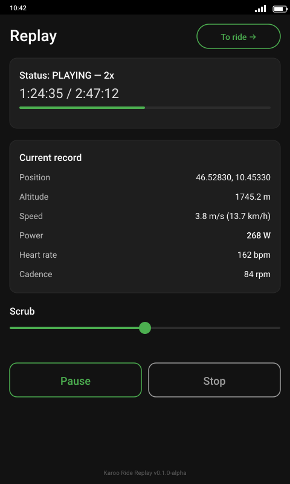

# Karoo Ride Replay

Open-source ride-simulation extension for Hammerhead Karoo cycling computers. Replays a recorded FIT file as mock GPS plus virtual sensor data — so other Karoo extensions run as if a real ride were happening, without leaving home.

<p align="center">
  
</p>

> Status: alpha (v0.1.0). Functionally complete; live-on-Karoo validation in progress.

## Why

Karoo extension development needs ride data. There's no Hammerhead-provided way to test extensions against meaningful sensor + GPS input without an actual ride. `karoo-ride-replay` fills that gap by playing back a real recorded ride from FIT — GPS, power, heart rate, cadence, speed, altitude, all at the original timing — so any other extension (7Climb, KPower, Wattramp, anything else) sees the data as if you were on the bike.

## Install on Karoo 3

The Karoo 3 doesn't have ADB enabled by default, so the supported sideload path is via the **Hammerhead Companion** mobile app (the same app you already use to push routes to your Karoo).

1. Pair your Karoo 3 with Hammerhead Companion (one-time, if you haven't already).
2. On your phone, open this URL in your browser:
   <br>**[https://github.com/lgangitano/karoo-ride-replay/releases/latest/download/karoo-ride-replay.apk](https://github.com/lgangitano/karoo-ride-replay/releases/latest/download/karoo-ride-replay.apk)**
3. After the APK downloads, long-press it (in your browser's download list or the Files app) → **Share** → **Hammerhead Companion**.
4. Companion pushes the APK to your Karoo. On the Karoo, accept the install prompt.
5. Open the app once from the Karoo's app drawer → grant **All files access** when asked (required to read `FitFiles/`).
6. In Android Developer Options → **Select mock location app**, pick *Karoo Ride Replay*. (If Dev Options aren't on yet: Settings → About → tap "Build number" seven times.)

## Install on Karoo 2

Karoo 2 has ADB enabled. Plug it in over USB and run:

```bash
adb install -r karoo-ride-replay.apk
```

(Download the APK from the [releases page](https://github.com/lgangitano/karoo-ride-replay/releases/latest) first.)

Then the same one-time setup as Karoo 3 — grant **All files access** on first launch, and designate the app as **mock location** in Developer Options.

## Using it

1. **Pick a ride** — the picker lists FIT files from `FitFiles/` and `Download/`, newest first.
2. **Set a start offset and playback speed** — skip the warmup, replay at 1×/2×/5×/10×.
3. **In Karoo Settings → Sensors → Add Sensor**, pair the four virtual sensors (Power / HR / Cadence / Speed) once.
4. **Hit Play.** The screen shows the live record (position, altitude, speed, power, HR, cadence) as the engine emits each FIT sample.
5. **Tap "To ride →"** (or minimize) to switch to the Karoo's normal ride view while playback continues — your other extensions see real-looking sensor + GPS data.
6. **Press the back button** to return to the ride picker and pick a different FIT (engine stops cleanly).

## Features (v0.1.x)

- **Ride library** — scans Karoo's `FitFiles/`, pick a past ride
- **Start-time offset** (hh:mm:ss) — skip to the interesting part
- **Mock GPS injection** via Android `LocationManager` — Karoo OS sees position move along the recorded route
- **Virtual sensor devices** for Power, Heart Rate, Cadence, Speed via the `karoo-ext` Device API
- **Variable playback speed** — 1× / 2× / 5× / 10×

### Planned

- External FIT import (drag-and-drop)
- Loop mode for repeated regression testing
- GPX import (route-shape testing without sensor data)

## Architecture

- `extension/KarooRideReplayExtension.kt` — `KarooExtension` service host
- `replay/` — FIT parser (Garmin official SDK) + playback engine (coroutine-driven, emits at FIT-recorded timing × speed multiplier)
- `vdevice/` — virtual sensor Devices (KPower pattern × 4)
- `mocklocation/` — Android `LocationManager` mock-provider integration
- `ui/` — Compose-based ride selector, configurator, playback control

## Build from source

```bash
# Requires Karoo Extension SDK auth (~/.gradle/gradle.properties with
# gpr.user + gpr.key, read:packages scope on a GitHub PAT)
./gradlew assembleRelease
adb install app/build/outputs/apk/release/karoo-ride-replay.apk
```

## License

Apache 2.0 — same as the `karoo-ext` SDK.
