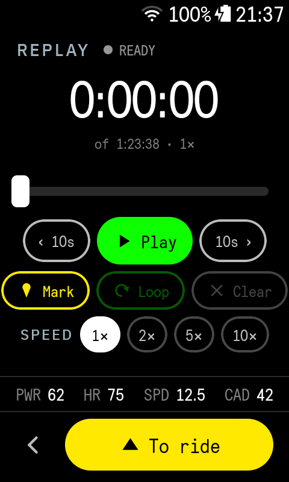

# Karoo Ride Replay

Open-source ride-simulation extension for Hammerhead Karoo cycling computers. Replays a recorded FIT file as mock GPS plus virtual sensor data — so other Karoo extensions run as if a real ride were happening, without leaving home.

<p align="center">
  
</p>

> Status: v1.1.0. Karoo-native UI, mock GPS scoped to active replays, per-sensor virtual devices with dropout simulation, a Replay data field with ride-screen controls, and control over adb.

## Why

Karoo extension development needs ride data. There's no Hammerhead-provided way to test extensions against meaningful sensor + GPS input without an actual ride. `karoo-ride-replay` fills that gap by playing back a real recorded ride from FIT — GPS, power, heart rate, cadence, speed, altitude, all at the original timing — so any other extension (KPower, Wattramp, or any sensor/GPS-consuming extension) sees the data as if you were on the bike.

## Install on Karoo 3

The Karoo 3 doesn't have ADB enabled by default, so the supported sideload path is via the **Hammerhead Companion** mobile app (the same app you already use to push routes to your Karoo).

1. Pair your Karoo 3 with Hammerhead Companion (one-time, if you haven't already).
2. On your phone, open this URL in your browser:
   <br>**[https://github.com/lgangitano/karoo-ride-replay/releases/latest/download/karoo-ride-replay.apk](https://github.com/lgangitano/karoo-ride-replay/releases/latest/download/karoo-ride-replay.apk)**
3. After the APK downloads, long-press it (in your browser's download list or the Files app) → **Share** → **Hammerhead Companion**.
4. Companion pushes the APK to your Karoo. On the Karoo, accept the install prompt.
5. Open the app once from the Karoo's app drawer → grant **All files access** when asked (required to read `FitFiles/`).
6. In Android Developer Options → **Select mock location app**, pick *Karoo Ride Replay*. (If Dev Options aren't on yet: Settings → About → tap "Build number" seven times.)

The app only takes over GPS while a replay is actually playing, and hands it straight back when you exit — so you can leave it selected as the mock-location app and still ride normally with real GPS. (No app restart needed after selecting it, unlike earlier builds.)

## Install on Karoo 2

Karoo 2 has ADB enabled. Plug it in over USB and run:

```bash
adb install -r karoo-ride-replay.apk
```

(Download the APK from the [releases page](https://github.com/lgangitano/karoo-ride-replay/releases/latest) first.)

Then the same one-time setup as Karoo 3 — grant **All files access** on first launch, and designate the app as **mock location** in Developer Options.

## Set up the sensors

Karoo Ride Replay publishes four virtual sensors, one per data channel: *Replay Power*, *Replay HR*, *Replay Cadence* and *Replay Speed*. Each is a separate sensor because the Karoo tracks connection status per sensor. That's what lets you drop out one channel (say, HR) while the others keep streaming.

**New install.** Pair once, on the Karoo:

1. Open **Sensors** and tap **Add Sensor**.
2. Pair *Replay Power*, *Replay HR*, *Replay Cadence* and *Replay Speed*. Pair only the ones you need. A channel you don't pair is simply not replayed.

**Upgrading from v0.9.0-beta or earlier.** Earlier versions published a single combined sensor called *Karoo Ride Replay*. That sensor no longer connects, so swap it for the four new ones:

1. Open **Sensors** and remove the existing *Karoo Ride Replay* sensor.
2. In **Sensors**, tap **Add Sensor** and pair *Replay Power*, *Replay HR*, *Replay Cadence* and *Replay Speed*.

If you still have the per-sensor pairings from v0.1.2-alpha, there's nothing to do. The four sensors use the same IDs, so they reconnect on their own.

## Using it

The app is two screens — **Select Ride** and **Replay** — styled to match Karoo OS.

1. **Pick a ride** — the picker lists FIT files from `FitFiles/` and `Download/`, newest first. Each row leads with the ride's write-time and a parsed `duration · distance · size`, and the currently-loaded ride is highlighted. Near-empty files (aborted/quick test recordings with no real ride in them) are filtered out. Tap a row to open it straight in Replay. Tap the **star** to pin a ride to the top of the list — pins persist across restarts.
2. **Pair the sensors** once, as described in [Set up the sensors](#set-up-the-sensors). Upgrading from v0.9.0-beta? Remove the old *Karoo Ride Replay* sensor first.
3. **Hit Play.** The Replay screen fits one pane: a large current-time readout, a draggable timeline, transport (‹10s / Play-Pause / 10s›), and a small strip confirming the live Power/HR/Speed/Cadence stream. Tap a sensor in the strip to simulate a dropout: it cycles streaming → searching (`···`) → missing (`--`) → streaming, and the Karoo shows that sensor's connection status to match.

   Two things to expect on the Karoo (seen on a Karoo 3):
   - **Missing looks like searching.** The Karoo starts reconnecting a dropped sensor straight away, so its data fields show *Searching...* for both, just as when a real strap's battery dies. The strip in the app tells the two apart.
   - **A Speed dropout is hidden while mock GPS is on.** With the Speed sensor searching or missing, the Speed field keeps showing a value, most likely the Karoo's GPS speed from the replayed route. Sensors still shows *Replay Speed* as searching.
4. **Scrub the timeline** — drag or tap anywhere to seek to that point of the ride.
5. **Mark / Loop / Clear** — drop bookmarks, then toggle **Loop** to repeat between the outer two marks (handy for regression-testing a segment). Scrubbing out of the marked window releases the loop.
6. **Speed** — replay at 1× / 2× / 5× / 10× to exercise a long ride quickly.
7. **To ride** — the full-width bar minimizes to the Karoo's normal ride view while playback keeps streaming (mock GPS stays active), so your other extensions see real-looking sensor + GPS data — and you can record a ride against the replay.
8. **Back** — the bottom-left chevron (or the hardware back button) returns to the picker; playback pauses and keeps its position (so re-selecting the ride resumes where you left off), and mock GPS is released so the Karoo returns to its real GPS.

## Controls on the ride screen

To pause, skip or change speed without leaving the ride screen, for example while you watch another extension's data field react, add the **Replay** data field to a ride page (edit the page, then pick it from the Ride Replay extension).

- **Full-width field:** a control bar with `‹ 10s`, play/pause, `10s ›`, the elapsed replay time, and the speed. Tap the speed to step through 1× → 2× → 5× → 10×.
- **Half-width field:** the elapsed time, state and speed. Tap anywhere on it to play or pause.

Playing from the field turns on mock GPS just like the Play button in the app. Pausing keeps mock GPS on, so the position holds where you stopped.

## Scripting over adb

You can drive a replay from a laptop, so extension tests are scriptable and repeatable. The Karoo 2 has adb on out of the box; on a Karoo 3, turn on developer mode first.

```bash
adb shell am broadcast -a it.gangitano.karooridereplay.LOAD   --es file FitFiles/ride.fit
adb shell am broadcast -a it.gangitano.karooridereplay.SPEED  --ef multiplier 10
adb shell am broadcast -a it.gangitano.karooridereplay.PLAY
adb shell am broadcast -a it.gangitano.karooridereplay.SEEK   --el seconds 1800
adb shell am broadcast -a it.gangitano.karooridereplay.PAUSE
adb shell am broadcast -a it.gangitano.karooridereplay.STATUS
adb shell am broadcast -a it.gangitano.karooridereplay.EXIT
```

| Action | Extra | What it does |
|---|---|---|
| `LOAD` | `file` — absolute path, or relative to the storage root (`FitFiles/…`, `Download/…`) | Loads the ride and answers once it's parsed, so the next command can follow straight away |
| `PLAY` | — | Starts or resumes playback and turns on mock GPS, like the Play button |
| `PAUSE` | — | Pauses, keeping the position |
| `SEEK` | `seconds` — elapsed time from the start of the ride | Jumps there, keeping play/pause state |
| `SPEED` | `multiplier` — any value from 0.1 to 100 | Sets the playback speed |
| `STATUS` | — | Changes nothing; just answers |
| `EXIT` | — | Pauses and releases mock GPS, like Back |

Numbers can be passed with `--ei`, `--el`, `--ef` or `--es`. (`--ed` works too where `am` supports it, but the Karoo 3's Android 12 doesn't.) Every command answers on the `am broadcast` result line with the state after the command:

```
Broadcast completed: result=-1, data="state=PLAYING elapsed=1800 total=5018 speed=10.0 file=/storage/emulated/0/FitFiles/ride.fit"
```

`result=-1` means success. `result=1` is an error, with the reason in `data` (`error: …`). `result=0` with no data means nothing received the command; check that Ride Replay is installed and the Karoo has started its extensions.

The commands are accepted only from adb and the system. Other apps on the Karoo can't send them.

## Features (v1.1.0)

- **Karoo-native UI** — the Hammerhead Visual Data Field System (pure-black, mono numerals, pill controls), one pane, no scrolling
- **Ride library** — scans Karoo's `FitFiles/`, leads with write-time + parsed duration/distance/size, hides near-empty recordings
- **Star favourites** — pin rides to the top of the list; pins persist across app restarts
- **Draggable timeline** — drag or tap to seek anywhere in the ride
- **Bookmarks + loop** — mark points and loop between two of them for repeated segment testing
- **Mock GPS injection** via Android `LocationManager` — Karoo OS sees position move along the recorded route
- **GPS scoped to active replays** — the mock provider is registered only while a replay is playing and released when you exit, so the Karoo uses real GPS whenever nothing is replaying (no dev-settings dance, no app restart)
- **Holds the GPS fix when stationary/paused** — within a replay, a ~1 Hz heartbeat re-publishes the last position through stopped/positionless stretches (and pauses), so consumers don't drop the fix
- **Virtual sensor devices** — one each for Power, Heart Rate, Cadence, Speed via the `karoo-ext` Device API
- **Sensor dropout simulation** — tap a sensor to set it searching or missing while the others keep streaming
- **Variable playback speed** — 1× / 2× / 5× / 10×
- **Ride-screen controls** — a Replay data field with play/pause, ±10 s and speed controls, so you never leave the ride screen
- **Scriptable over adb** — load, play, pause, seek, set the speed and read the state from a laptop ([details](#scripting-over-adb))
- **State survives round-trips** — reopening from the Extensions list (single-instance, so Open resumes rather than restarts), or backing out and re-selecting a ride, resumes in place

### Planned

- External FIT import (drag-and-drop)
- GPX import (route-shape testing without sensor data)

## Architecture

- `extension/KarooRideReplayExtension.kt` — `KarooExtension` service host
- `replay/` — FIT parser (Garmin official SDK) + playback engine (coroutine-driven, emits at FIT-recorded timing × speed multiplier)
- `vdevice/` — virtual sensor Devices (KPower pattern × 4)
- `mocklocation/` — Android `LocationManager` mock-provider integration
- `remote/` — the adb command receiver and its parsing
- `fields/` — the ride-screen data fields and their tap receiver
- `ui/` — Compose ride selector + merged replay/playback control, themed to the Karoo Visual Data Field System (`ui/theme/`)

## Build from source

```bash
# Requires Karoo Extension SDK auth (~/.gradle/gradle.properties with
# gpr.user + gpr.key, read:packages scope on a GitHub PAT)
./gradlew assembleRelease
adb install app/build/outputs/apk/release/karoo-ride-replay.apk
```

## License

Apache 2.0 — same as the `karoo-ext` SDK.
